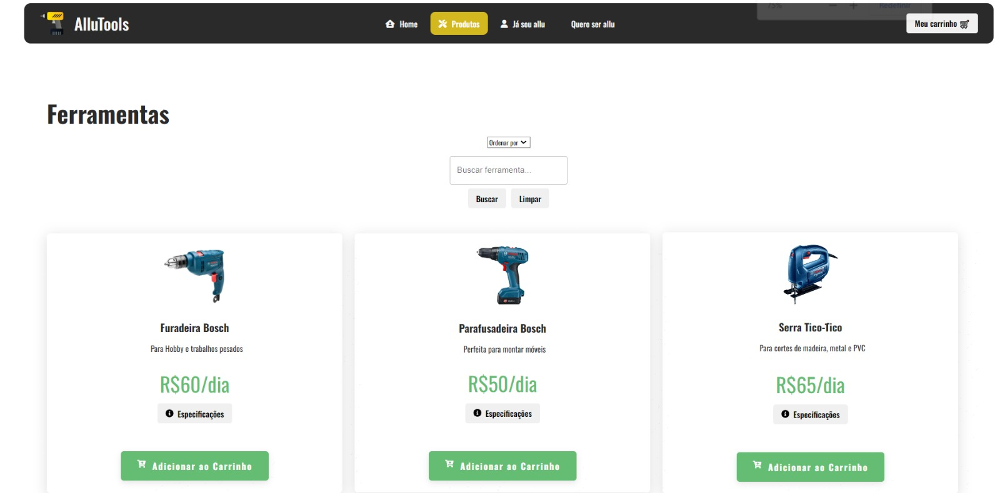
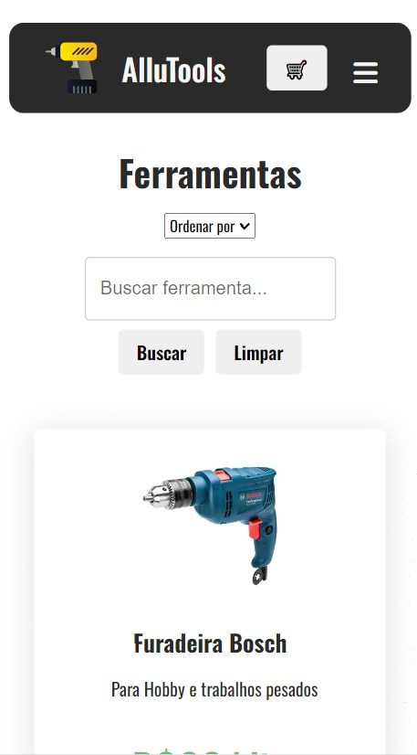

# AlluTools 🛠
- **Deploy realizado com:** AWS S3 & CloudFront
- **Acesse o projeto aqui:** [http://d1srmwp803c68a.cloudfront.net](http://d1srmwp803c68a.cloudfront.net) (API interrompida por falta de pagamento 😁)

<div align="center">
  <h3>Uma aplicação web moderna com design responsivo para aluguel de ferramentas</h3>
  <p>Selecione, adicione ao carrinho e alugue sua ferramenta desejada em poucos cliques!</p>
  
  
  
  
  
</div>

### 📑 Sumário
- [Sobre o Projeto](#sobre-o-projeto)
  - [Construído Com](#construído-com)
- [Começando](#começando)
  - [Pré-requisitos](#pré-requisitos)
  - [Instalação](#instalação)
- [Uso](#uso)

## Sobre o Projeto

A aplicação "AlluTools" foi desenvolvida com a intenção de simplificar o processo de aluguel de ferramentas. Com ela, os usuários podem:
- Navegar por uma variedade de ferramentas
- Ver especificações técnicas e detalhes
- Adicionar produtos ao carrinho
- Realizar um checkout, fornecendo sua identidade para a reserva
- Consultar seus pedidos realizados

### Construído Com

Este projeto foi desenvolvido utilizando as seguintes tecnologias:
- [React JS](https://reactjs.org/)
- [Material UI](https://mui.com/)
- [Axios](https://axios-http.com/)
- [AntD](https://ant.design/)

## Começando

### Pré-requisitos

Antes de rodar o projeto localmente, você deve configurar a seguinte variável de ambiente:

- `REACT_APP_API_MAIN`: URL da API principal. Adicione este valor ao arquivo `.env` no diretório raiz do projeto.
  
🛸 [Link repositório API](https://github.com/mateusgambaro/rent-tools-api)

### Instalação

1. Clone o repositório
   ```sh
   git clone git@github.com:mateusgambaro/rent-tools-app.git
   
2. Instale as dependências do projeto
   ```sh
   npm install

3. Rode o projeto
   ```sh
   npm start

### Uso
   Após a instalação e execução, acesse http://localhost:3000 no seu navegador.

### 🙆‍♂️ Login de teste
  Você pode utilizar esse usuário para efetuar compras e visualizar os pedidos ou criar um novo.
  - **Email**: mateusgambaro@gmail.com
  - **Senha**: password1

